无监督学习

> 聚类算法：一种将数据归并到各个类中的方式
>
> 异常检测

推荐系统

强化学习

# 1.聚类

聚类算法查看许多数据点并自动查找相关联或相似的数据点

## 1.1 K-means聚类算法

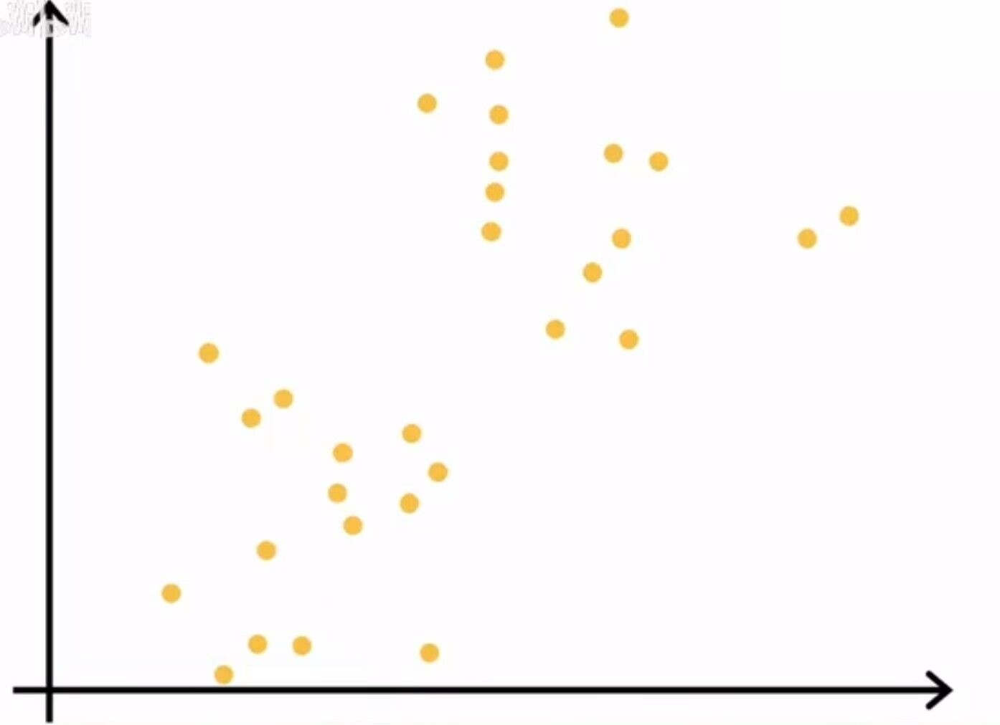

在这个数据集上运行k均值聚类算法

（1）k均值聚类算法做的第一件事就是随机猜测，选择两个点作为初始的聚类质心

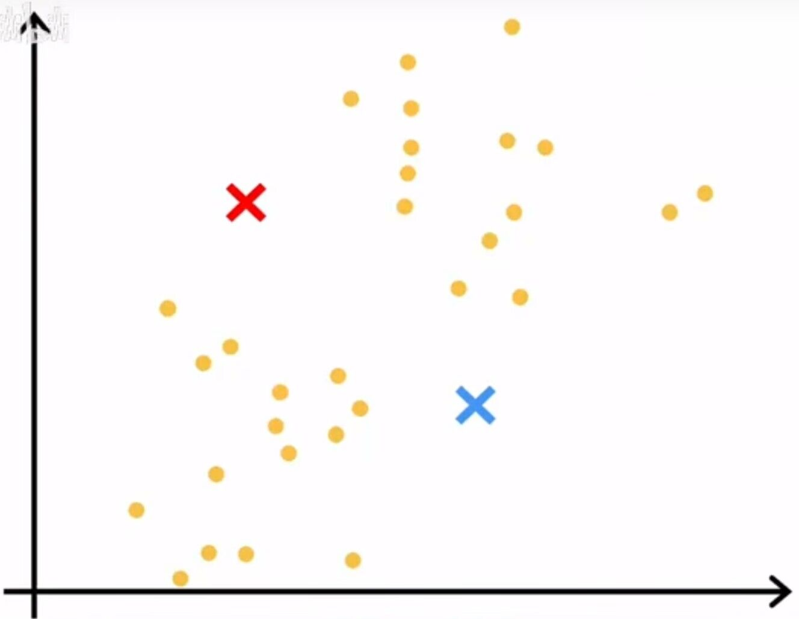

（2）判断所有点是更接近蓝色还是红色，并将其分配给距离最近的聚类中心。

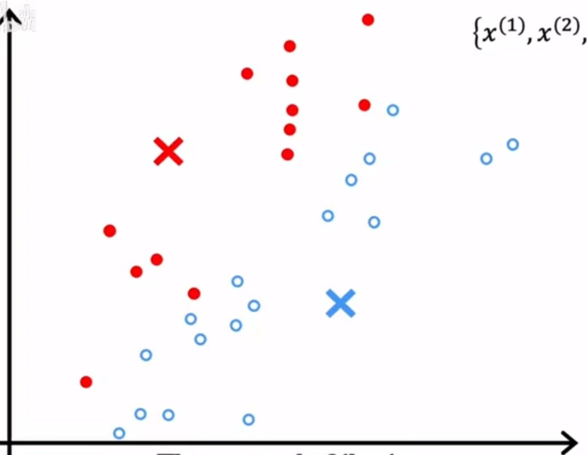

（3）查看所有的红点并取平均值，将红的聚类质心移动到均值位置，蓝色也相同

> 平均值：横轴上的平均值，纵轴上的平均值
>
> 获得质心的新位置

重复(2)(3)步骤,，直至点的颜色没有更多的变化

如果一个聚类质心没有分配给它的训练示例。

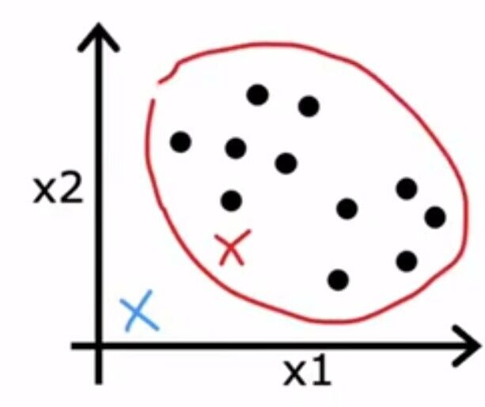

最常见的做法是消除该集群

## 1.2初始化

集群数量K<训练示例M

随机选择k个训练示例

运行K均值聚类算法

计算成本函数

选择最低成本的聚类集

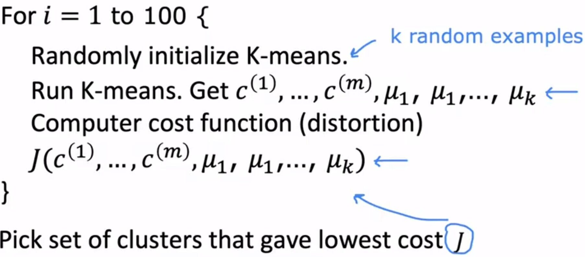

## 1.3选择聚类的个数

有一种选择聚类数目的方法叫做肘法，运用各种K值绘制成本函数，曲线弯曲的地方称之为肘部。

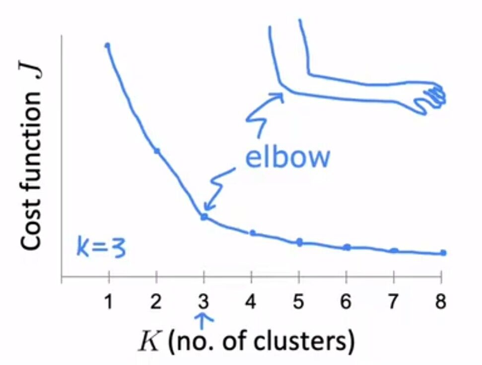

但是对于很多应用程序来说，正确的集群数量是模棱两可的

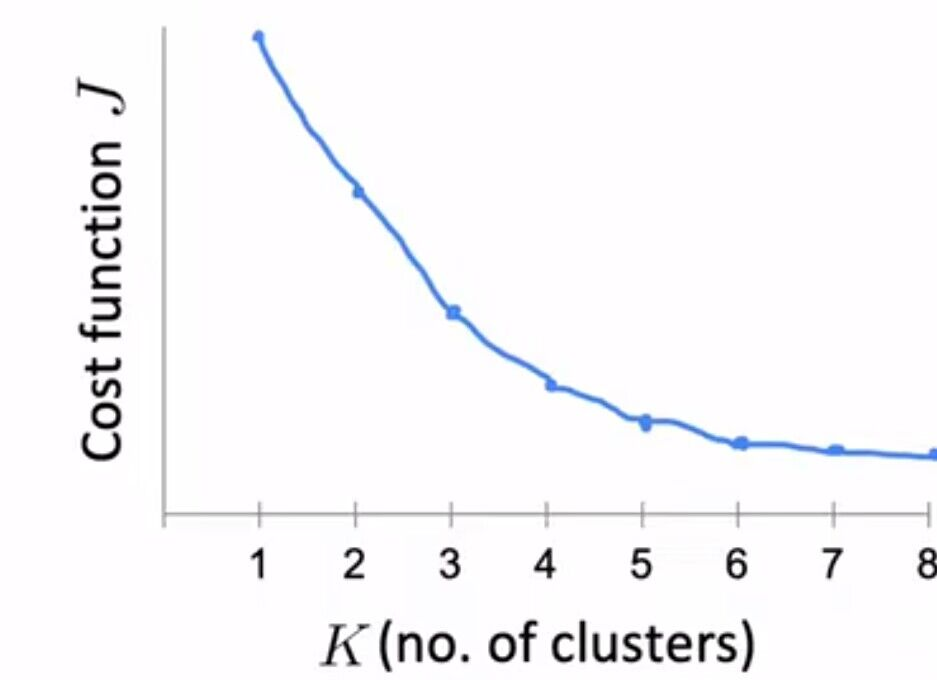

# 2.异常检测算法

查看为标记的正常事件数据集，从而学会检测，如果发现异常事件会发出危险信号。

举个例子，用异常检测来检测一个飞机发动机制造出来后看起来正不正常

x1测量发动机产生的热量，x2测量振动强度

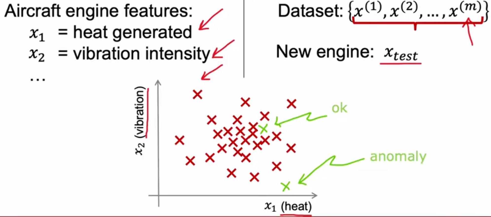

新的飞机引擎数据点与其他的点与众不同，我们觉得它可能有问题。

进行异常检测的常见方法是一种被称为**密度估计**的技术。

第一件事为x的概率建立一个模型（学习算法试图找出高概率的值以及不太可能的值）

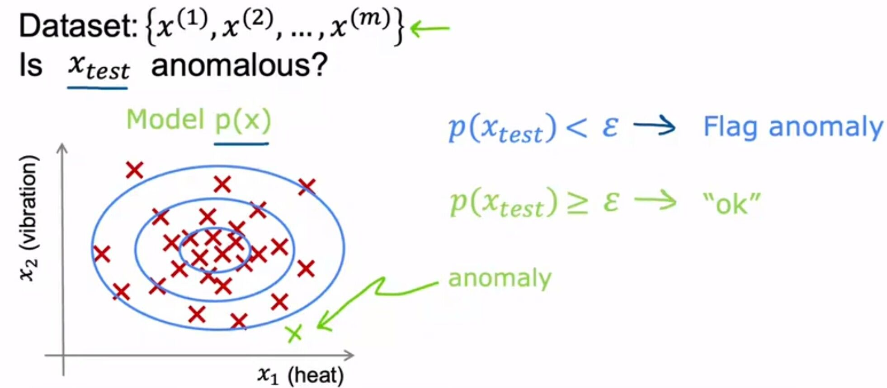

---

异常检测还经常用于欺诈检测。

例如：如果现在正在使用一个具有许多不同功能的网站，xi是用户i活动的特征（特征的例子包括多久登录一次等）

根据这些可能从一个数据到另一个模型对x的p进行建模。

在欺诈检测的通用工作流程中，如果一个用户不正常会进行一些额外的安全检查，比如验证手机号。

这种类型的欺诈检测既用于发现假账户也经常被用来识别财务诈骗

# 3.高斯分布

高斯分布也叫正态分布。

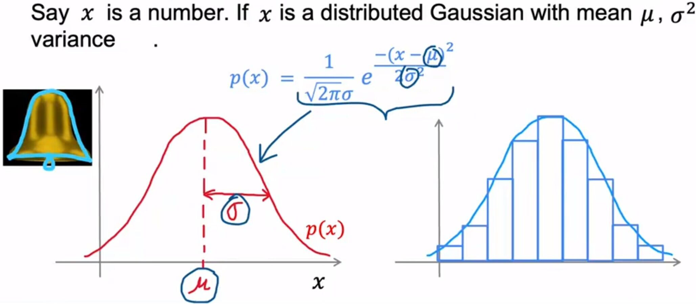

改变参数的值

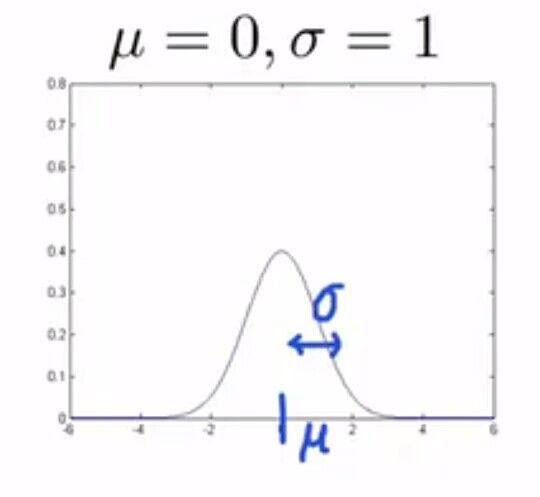

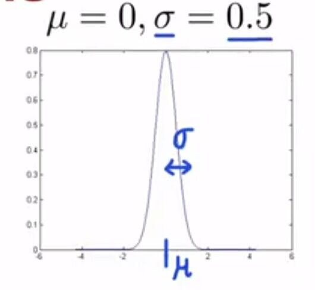

不管参数如何变幻，函数的面积总是等于1

# 4.异常检测算法

假设我们有多个例子，每个例子都有多个特征，每个例子x是一个有n个数字的向量。

我们将建立一个模型估计P(x)

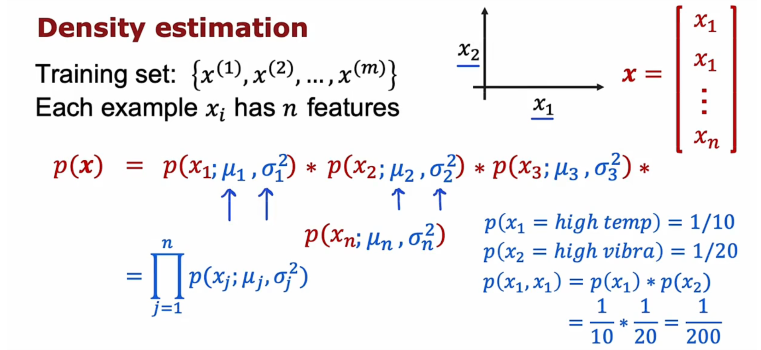

X 是一个特征向量，那么概率P(x)等于每一个特征的概率相乘。

---

异常检测算法

（1）选择可能是一些反常的例子

（2）选出需要的特征，计算参数μ1到μn，σ1平方到σn平方，用于数据集中的n个特征。

（3）获得一个新的例子之后，计算p（x）

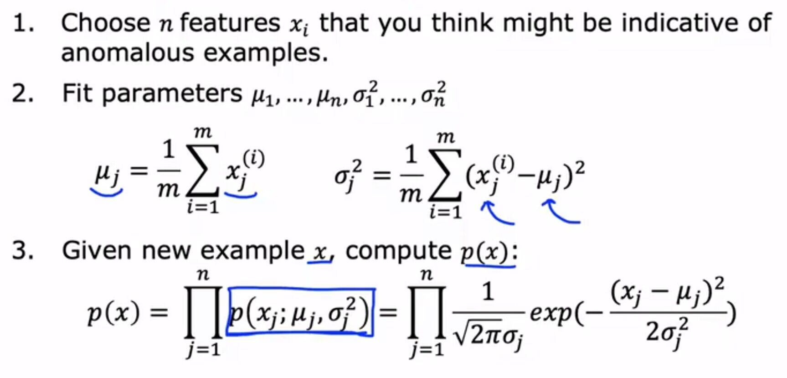

最后一步看p(x)是否小于ε，如果小于，则标记异常

# 5.评估异常检测系统

如何评估算法？

首先在训练集上拟合P(x) 模型 ，然后在交叉验证数据集上和测试数据集上进行预测。设置阈值ε ，如果小于ε 则输出1，表示异常；如果大于ε 则输出0，表示正常。

基于这个，可以判断算法的预测的准确性。

# 6.异常检测和监督学习

什么时候使用异常检测，什么时候使用监督学习

**异常检测：**

当有很少的正面例子，和大量的反面例子，尝试建立P(x) 模型，P(x) 中的参数仅从负样本中学习，正例仅用于交叉验证集和测试集，用于参数调整和评估。

**监督学习：**

大量的正面例子和负面例子。

---

异常检测与监督学习查看数据集的方式完全不同。

如果我们认为有许多不同类型的异常或许多不同类型的正面例子，异常检测可能更合适。因为异常检测查看正常的例子，任何偏离正常的例子，标记为异常。

使用监督学习时，有足够多的正面例子了解正面例子是什么样的，我们倾向于假设为正例的例子可能与训练集中的正例相似。

异常检测例子：诈骗，不断出现全新的诈骗手法和独特形式的财务欺诈

监督学习例子：垃圾邮件，垃圾邮件一直不断试图出售类似的东西。

# 7.选择要使用的特征

在从未标记的数据中运行或学习异常检测算法难找出忽略哪些特征，因此发现仔细选择特征更加重要。

一个步骤是，尽量确保给的特征或多或少是高斯的

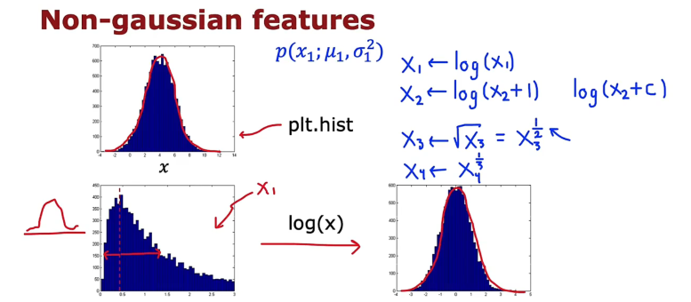

如果不符合高斯，考虑转变为高斯。

除了确保我们的数据近似高斯之外，在训练好了异常检测算法后，在验证数据集上效果不佳，还可以执行异常检测的错误分析过程，换句话说，就是可以在出错的时候尝试查看算法在哪些方面做的不好，然后尝试想出改进的方法。

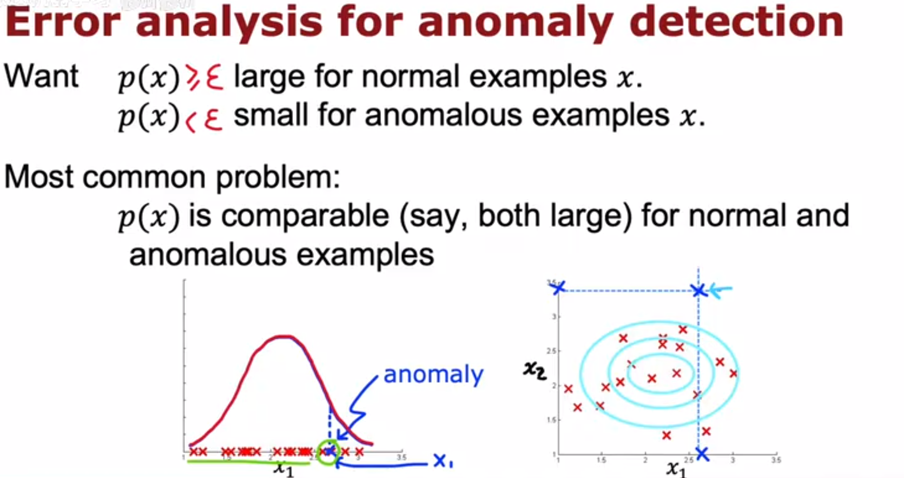

当从未标记的数据中学习了模型p(x)，可能遇见最常见的问题是p(x)的值是可比的，对于正常或者异常的例子，值都很大。

这就会导致，当一个示例是异常情况，但是它的概率比较大，最后判定还是正常。

在这种情况下，我们通常可以查看一下这个特例，试着找出是什么特征让我们认为这是一个异常的例子，如果我们可以找到一些新特征，比如x2，这有助于将这个示例和普通示例区分开来。 然后添加这个特征，可以帮助提高算法的性能。